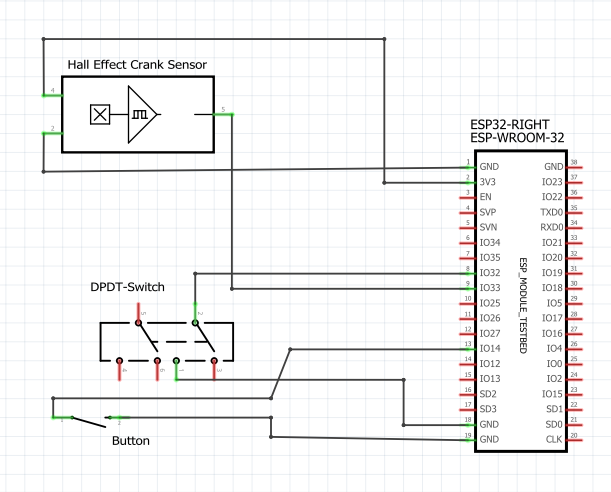
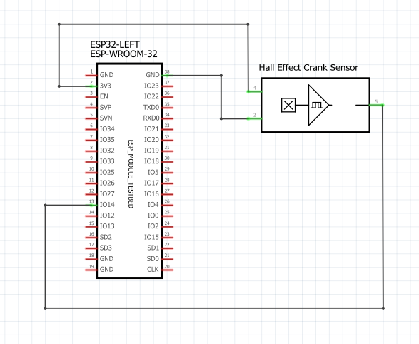

# GrannyPanic!

## Description
This game project was done as part of ICT-engineering degree during autumn 2025. The idea was to create a game with physics as realistic as possible and the game should be suitable for exhibition use, so the playthrough time shouldn't exceed 3 minutes. 

We ended up with an idea, where a sweet granny has to make her way to the store as fast as possible using a wheelchair. The 'realistic physics' -part was executed by us building the controller directly into a real wheelchair. We used two ESP32 for the controllers on each side of the wheels ([Wheelchair setup](SUUNNITTELU/pyörätuoli.jpg)). The movement of the wheels is tracked by two magnetic Hall sensors (1GT101DC), one on each side of the wheels. In addition to this we 3D-printed a wheel with embedded holes for 8mm magnets ([Blender model can be found here](SUUNNITTELU/magneettikeha2(1).3mf)) and the movement was tracked by the change in magnetic force by the magnets passing. Blender model of the magnetic wheel can also be found from the "SUUNNITTELU" -folder. Direction change is handled by a switch and the menus use an arcade button for selecting items. 

This repository is mainly done to showcase the project as a whole, the scripts aren't optimized and the final version of the game is far from "perfect". Due to the ICT-degree programme being in finnish, also commits and parts of the project (meaning the script names, the different variables in scripts, asset names, sounds etc.) were mostly executed using finnish. 

PLEASE NOTE THAT THIS GAME WAS DONE WITH UNITY VERSION [6000.2.2f1.](https://unity.com/security/sept-2025-01)

## Visuals
 

## Circuit diagrams for the ESP32 -microcontrollers and related accessories
### Right side:

### Left side:

## Authors and acknowledgment
This project was a team-effort and done in collaboration with @saarailtanen, @mkangash & @Lauri. Special thanks to Tiitus Tulla for making the GrannyPanic! -soundtrack. 

The assets used are free assets downloaded from the Unity store and are included in the project files.

## License
MIT License

Copyright (c) 2025 maijakuu

Permission is hereby granted, free of charge, to any person obtaining a copy
of this software and associated documentation files (the "Software"), to deal
in the Software without restriction, including without limitation the rights
to use, copy, modify, merge, publish, distribute, sublicense, and/or sell
copies of the Software, and to permit persons to whom the Software is
furnished to do so, subject to the following conditions:

The above copyright notice and this permission notice shall be included in all
copies or substantial portions of the Software.

THE SOFTWARE IS PROVIDED "AS IS", WITHOUT WARRANTY OF ANY KIND, EXPRESS OR
IMPLIED, INCLUDING BUT NOT LIMITED TO THE WARRANTIES OF MERCHANTABILITY,
FITNESS FOR A PARTICULAR PURPOSE AND NONINFRINGEMENT. IN NO EVENT SHALL THE
AUTHORS OR COPYRIGHT HOLDERS BE LIABLE FOR ANY CLAIM, DAMAGES OR OTHER
LIABILITY, WHETHER IN AN ACTION OF CONTRACT, TORT OR OTHERWISE, ARISING FROM,
OUT OF OR IN CONNECTION WITH THE SOFTWARE OR THE USE OR OTHER DEALINGS IN THE
SOFTWARE.

## Project status
This project is mostly done, and aside from small improvements in code readability further updates won't be coming. 
